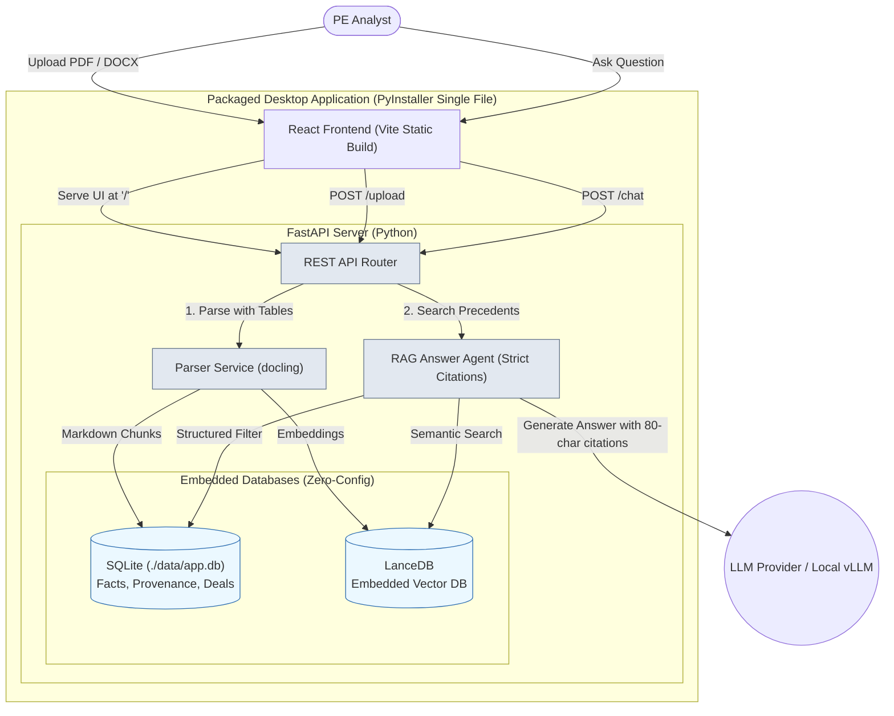

# Open-Source Architecture For PE Institutional Memory

This document maps the target system to open-source components while preserving the option to use either local open-source inference or an external LLM provider.

## Design Goal

Build a private equity decision-support system that can:

- retrieve historical precedent with evidence
- distinguish between historical preference and historical success
- support IC memo production and post-IC writeback
- remain auditable and locally deployable

This is not a "chatbot + RAG" system.

## Current MVP Architecture (Out-of-the-Box)

Following the DX expansion pivot, the application is bundled as a single-file zero-config executable for end users. The infrastructure relies entirely on in-process services.

## Target Layer Mapping (Future State)

### 1. Source of truth

Use:

- local file store for memos, DD reports, portfolio reviews, rejected deals, committee notes
- optional external feeds for market data and benchmarks

Guiding rule:

- not all evidence has equal weight
- partner notes, final IC memos, and post-investment outcomes should outrank drafts

### 2. Canonical deal model

Use:

- `PostgreSQL` in production
- `SQLite` only for MVP and local prototyping

Core tables:

- `deals`
- `documents`
- `document_provenance`
- `deal_document_links`
- `outcome_snapshots`
- `workflow_runs`

The canonical deal model should store:

- company, sector, geography, stage, fund, year
- entry valuation and key financials
- decision status and outcome status
- partner ownership and committee notes
- milestone timeline

### 3. Knowledge graph

Use:

- `Neo4j`

Model nodes such as:

- Deal
- Company
- Partner
- Fund
- Theme
- Risk
- Exit
- Failure mode

Use the graph for:

- similar path retrieval
- sponsor / partner relationship analysis
- shared failure-pattern search

### 4. Hybrid retrieval

Use:

- `Qdrant` for semantic retrieval
- `PostgreSQL` filters for structured retrieval
- `Neo4j` traversals for relationship retrieval

Retrieval should combine:

1. semantic similarity
2. structured similarity
3. graph similarity
4. outcome-aware similarity

The ranking target is not "closest wording". It is "highest decision value".

### 5. LLM and reasoning layer

Use one of two modes:

- local open-source inference via `vLLM`
- external provider via OpenAI-compatible API

Recommended local models to evaluate:

- `Qwen2.5-7B-Instruct`
- `Llama-3.1-8B-Instruct`
- `Mixtral` family for larger local deployments

LLM responsibilities:

- synthesize evidence packs
- draft IC memo sections
- produce follow-up questions
- surface uncertainty and evidence gaps

LLM must not:

- invent data
- recommend final approval
- override missing evidence

### 6. Workflow orchestration

Use:

- `LangGraph`

Recommended workflow stages:

1. deal intake
2. schema extraction
3. precedent scan
4. risk-gap analysis
5. DD question generation
6. IC memo drafting
7. committee challenge simulation
8. post-IC writeback

### 7. Connectors and indexing

Use:

- `LlamaIndex`

Role:

- connect PDF, DOCX, SQL, APIs, document stores
- apply metadata filters
- standardize ingestion contracts

### 8. Security and governance

Use:

- `PostgreSQL` row-level security
- network isolation around `Qdrant` and model-serving endpoints
- request/response trace persistence

Store per response:

- prompt version
- model version
- selected docs
- retrieved chunk ids
- timestamps
- manual edits

## Recommended Delivery Phases

### Phase 1

Implement:

- institutional memory
- precedent retrieval
- provenance tracking

Success criteria:

- answer which precedents are most similar
- explain why they passed or failed
- show later outcomes where available

### Phase 2

Implement:

- canonical deal model
- outcome labels
- structured retrieval

Success criteria:

- compare current deal against approved, rejected, and failed precedents
- filter by fund, geography, stage, partner, year

### Phase 3

Implement:

- LangGraph IC workflow
- memo generation
- DD question generation
- committee challenge workflow

### Phase 4

Implement:

- style engine
- outcome engine
- deviation engine

This is the point where the system starts producing institution-specific decision support rather than just precedent search.

## What This Repository Now Covers

Today this repository covers part of Phase 1:

- document ingestion
- Markdown-preserving parsing
- vector indexing
- metadata filtering
- canonical deal shell
- provenance capture
- retrieval traces

It does not yet cover:

- PostgreSQL production schema
- row-level security
- Neo4j graph retrieval
- LangGraph workflows
- LlamaIndex connectors
- outcome engine / deviation engine
